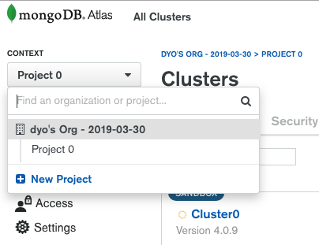
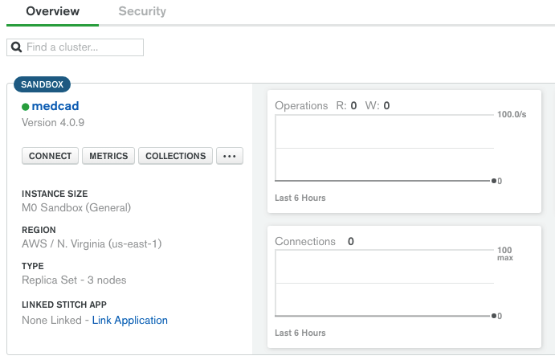
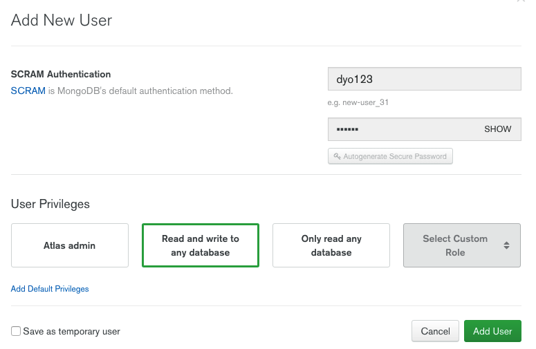
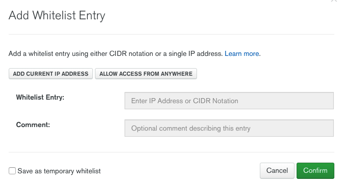

# Cara Setup MongodDB Atlas.

### by mediocademy.com

Silahkan register ke MongoDB Atlas disini:

mongodb.com

atau

https://cloud.mongodb.com/user#/atlas/register/accountProfile

Lanjut login, pada dashboard, klik menu dropdown dan klik new project > buat project baru namanya terserah anda.



```>``` Klik Build a Cluster.

```>``` Klik Cloud Provider & Region dan Pilih default cloud yaitu AWS dan N.Virginia.

```>``` Klik Cluster Tier pilih M0 Sandbox / Free.

```>``` Lanjut ke Cluster Name, berinama (terserah anda).

```>``` Klik Create Cluster, (Proses nya akan memakan waktu beberapa menit).

Setelah selesai seperti gambar dibawah ini:



```>``` Klik tab security dan klik add new user. Untuk pilihan User Privileges pilih default yaitu Read and write to any database. Lanjut klik Add User button.



```>``` Pada halaman daftar user klik IP Whitelist, klik add IP Address.



Anda bisa memilih **Add Current IP Address**: otomotis akan menampilkan IP address anda. 
Atau **Allow Access From Anywhere**, pada project case ini kita akan memilih **Allow Access From Anywhere**.

```>``` Klik kembali Tab **Overview**. Lanjut dengan klik **connect** > dan klik **connect your application** > anda akan mendapatkan string yang dapat anda copas ke dalam kode anda (sebagai plug in Express app) agar kita dapat akses ke database.